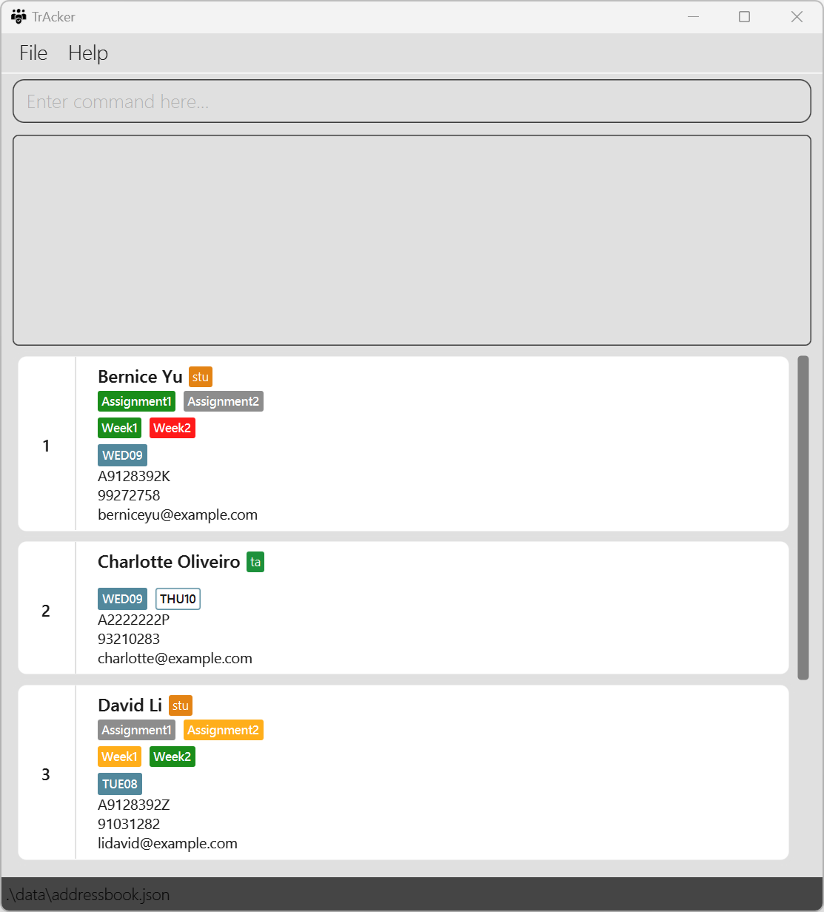
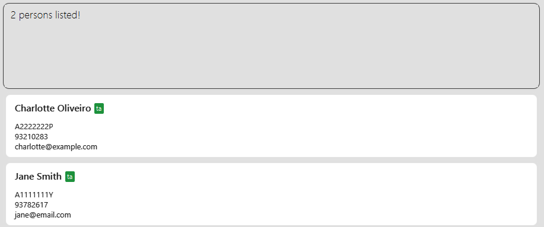

**TrAcker** is a handy contact management app built for CS Head Teaching Assistants (TAs) in NUS.
Optimized for use via a command line interface, you can manage student assignments, attendance,
tutor availability and much more with just a few keystrokes!

* Table of Contents
{:toc}

--------------------------------------------------------------------------------------------------------------------

## Quick start

1. Ensure you have Java `11` or above installed in your Computer.

2. Download the latest `TrAcker.jar` from [here](https://github.com/AY2324S2-CS2103T-T11-4/tp/releases).

3. Copy the file to the folder you want to use as the _home folder_ for your **TrAcker** app.

4. Open a command terminal, `cd` into the folder you put the jar file in, and use the `java -jar TrAcker.jar` 
   command to 
   run the application. 
   The GUI with some sample data should appear in a few seconds:  
   

5. Type the command in the command box and press Enter to execute it. 
   Some example commands you can try:
   * `list` : Lists all contacts.
   
   * `add stu /n John Doe /i A0123456Y /p 91234567 /e johndoe@ex.com` : Adds the Student `John Doe` to your contact list.
   
   * `add ta /n Jane Smith /i A0654321Y /p 97654321 /e janesmith@ex.com` : Adds the TA `Jane Smith` to your contact list.
   
   * `delete 3` : Deletes the 3rd contact shown in the displayed list.

   * `clear` : Deletes all contacts.

   * `exit` : Exits the app.

6. If a command is not recognized, a message containing the correct usage of the command will be shown.

7. Refer to the [Features](#features) below for details of each command.

--------------------------------------------------------------------------------------------------------------------

## Basic Features

**:information_source: Notes about the command format:** 

* Words in `UPPER_CASE` are the parameters to be supplied by the user. 
  e.g. in `add stu /n NAME`, `NAME` is a parameter that can be used as `add stu /n John Doe`.

* Parameters with `...` after them can be supplied by the user for zero, one or more times. 
  e.g. `[/t TAG...]` can be used as `/t Assignment1` or `/t Assignment1 Assignment2`(`Assignment1` and `Assignment2`
would be treated as two different tags. Refer to the [Tagging](#Tagging) section for more information) etc.

* Items in square brackets are optional. 
  e.g. `/n NAME [/p PHONE]` can be used as `/n John Doe /p 91234567` or as `/n John Doe`.

* Vertical bar (pipe) `|` is used to denote alternatives. 

* Pipe symbol and square brackets together `[|]` denote alternative items that are optional. 
  e.g. in `add [stu | ta] /n NAME`, `stu` and `ta` are alternatives, either exactly one or none of them should be used.

* Parameters can be supplied in any order. 
  e.g. if the command specifies `/n NAME /i ID`, `/i ID /n NAME` is also acceptable and has the same effect.

* Extraneous parameters for commands that do not take in parameters (such as `help`, `list`, `exit` and `clear`)
will be ignored. 
  e.g. if the command specifies `help 123`, it will be interpreted as `help`.

* If you are using a PDF version of this document, be careful when copying and pasting commands that span across
multiple lines as space characters surrounding line-breaks may be omitted when copied over to the application.

### Adding a Student or TA: `add stu`, `add ta`

Adds a Student/TA to the address book.

Format:
* To add a Student, 
  `add [stu] /n NAME /i ID /p PHONE /e EMAIL`

* To add a TA, 
  `add ta /n NAME /i ID /p PHONE /e EMAIL`

:bulb: **Notes:** 

* Every person is saved either as a Student or TA. If the type of the person is not specified, the person will be
  saved as a Student by default.
* Each person's ID is unique, so you cannot add 2 people with the same ID.

Examples:
* `add stu /n Alex Yeoh /i A0777777L /p 87438807 /e alexyeoh@example.com`
* `add ta /n Charlotte Oliveiro /i A2222222P /p 93210283 /e charlotte@example.com`

### Listing all persons : `list`

Shows a list of all persons in TrAcker.

Format: `list`

### Editing a person : `edit`

Edits an existing person in the address book.

Format: `edit INDEX [/n NAME] [/p PHONE] [/e EMAIL]`

* Edits the person at the specified `INDEX`. The index refers to the index number shown in the displayed person list.
  The index **must be a positive integer** 1, 2, 3, ...​
* At least one of the optional fields must be provided.
* Existing values will be updated to the input values.
* A person's `type` (`stu` or `ta`) and `ID` cannot be edited.

Examples:
*  `edit 1 /p 91234567 /e johndoe@example.com` Edits the phone number and email address of the 1st person to be 
   `91234567` and `johndoe@example.com` respectively.
*  `edit 2 /n Betsy Crower` Edits the name of the 2nd person to be `Betsy Crower`.

### Locating persons: `find`

Filters all persons whose contact details contain each of the specified keywords 
under the specified flag and displays them as a list with index numbers.

Format: `find [stu | ta] [/n NAME] [/i ID] [/p PHONE] [/e EMAIL] [/t TAGS...]`

* At least one of the optional fields must be provided.
* The search is case-insensitive. e.g. `hans` will match `Hans`
* The order of the keywords under each flag does not matter. e.g. `Hans Bo` will match `Bo Hans`
* Subwords will be matched e.g. `Han` will match `Hans`
* For Tags:
    * For tutorial tags, subword matching is performed
    * For other tags, it performs full word matching
    * The search filters for persons meeting ANY criteria, (i.e. `OR` search).
   
    e.g. `find /t wed assignment1` will find all persons with the tutorial tag where `wed` is a subword or have tag `assignment1`

* The search filters for persons meeting ALL criteria, (i.e. `AND` search).

  e.g. `find stu /n John` will find all Students whose names contain `John`.

Examples:
* `find /n John` returns `john` and `John Doe`
* `find ta` returns all TAs
  

### Deleting persons : `delete`

Deletes the person(s) specified by their indices from the displayed person list. A popup will appear to confirm the 
deletion.

Format: `delete (all | INDEX [OTHER_INDICES...])`

* Deletes the person(s) at the specified `INDEX`s.
* If `all` is used, all persons in the displayed list are deleted. The displayed list might be the same as the full
list. For example, if the `delete all` command is used after a `find NAME` command, all contacts found by
the `find NAME` command would be deleted but not those excluded from the displayed list.
* The index refers to the index number shown in the displayed person list.
* The index **must be a positive integer** 1, 2, 3, …​

Examples:
* `list` followed by `delete 2` deletes the 2nd person in the address book.
* `find Betsy` followed by `delete 1` deletes the 1st person in the results of the `find` command.

### Clearing all entries : `clear`

Clears all entries from the address book.

Format: `clear`

### Exiting the program : `exit`

Exits the program.

Format: `exit`

### Saving the data

TrAcker data is saved in the hard disk automatically after any command that changes the data. There is no need to save manually.

### Editing the data file

TrAcker data is saved automatically as a JSON file `[JAR file location]/data/addressbook.json`. Advanced users are welcome to update data directly by editing that data file.

:exclamation: **Caution:**
If your changes to the data file makes its format invalid, TrAcker will discard all data and start with an empty data file at the next run. Hence, it is recommended to take a backup of the file before editing it. 
Furthermore, certain edits can cause the TrAcker  to behave in unexpected ways (e.g., if a value entered is outside of the acceptable range). Therefore, edit the data file only if you are confident that you can update it correctly.

--------------------------------------------------------------------------------------------------------------------

## Tagging

With TrAcker tags, you can track assignment status, tutorial attendance and tutorial groups students are attending.
For TAs, you can track their tutorial slots assigned and their availability for replacing other TAs in case 
substitutions are needed.

TrAcker allows use of three different types of tags : **Assignments, Attendance,** and **Tutorial** tags which can be attached to Students and TAs respectively.
The different tag types along with their corresponding tag statuses are described below.

### Tag Status

| Tag type   | Status                                                                                                                                                                                                                                                                             |
|------------|------------------------------------------------------------------------------------------------------------------------------------------------------------------------------------------------------------------------------------------------------------------------------------|
| Assignment | `cg` : <mark style="background-color: green">COMPLETE_GOOD</mark> `cb` : <mark style="background-color: orange">COMPLETE_BAD</mark> `ig` : <mark style="background-color: grey">INCOMPLETE_GOOD</mark> `ib` : <mark style="background-color:red">INCOMPLETE_BAD</mark> |
| Attendance | `p` : <mark style="background-color:  green">PRESENT</mark> `a` : <mark style="background-color:red">ABSENT</mark> `awr` : <mark style="background-color:orange">ABSENT_WITH_REASON</mark>                                                                                 |
| Tutorial | `as` : <mark style="background-color: #3e7b91">ASSIGNED</mark> `av` : <mark style="background-color: white">AVAILABLE</mark>                                                                                                                                                   |

### Tag Name
Tag names have the following constraints:
- must be alphanumeric
- no whitespace between words in the tag
- all tag names must be unique.

Here are some recommended tag names for the various tag types.

| Tag type   | Examples of recommended tag names |
|------------|-----------------------------------|
| Assignment | `Assignment1` `v1.1Issues`        |
| Attendance | `Week1` `Week2`                   |
| Tutorial   | `TUE08` `WED10` `THU09`           |

### Marking a tag : `mark`

Updates the status of the specified tag with the specified status. If the
tag specified does not exist, a new tag with the tag name and tag status will be
created.

Format: `mark ( all | INDEX [OTHER_INDICES...] ) /t TAG [OTHER_TAGS...] /ts TAG_STATUS`

* The index refers to the index number shown in the displayed person list.
* The index **must be a positive integer** 1, 2, 3, …​
* When `all` is used, the command will apply to all persons in the displayed list.
* When multiple `TAG`s are specified, the same `TAG_STATUS` will be applied to all the tags.
* `TAG_STATUS` must be one of the [above specified values](#tag-status)

Examples:
* `mark 1 /t Assignment1 /ts cg` updates the `Assignment1` tag
to <mark style="background-color: green">COMPLETE_GOOD</mark> for the 1st person in the displayed list if they already
have the tag. The `Assignment1` tag of <mark style="background-color: green">COMPLETE_GOOD</mark> status would be added
to the contact if they previously did not have the tag.
* `mark 2 3 /t week1 week2 /ts awr` updates the `week1` and `week2` tags to
<mark style="background-color: orange">ABSENT_WITH_REASON</mark> for the 2nd and 3rd persons in the displayed list
if they already have the tag. Both tags with specified status would be added to the two contacts if any of them
previously did not have the tags.
* `mark all /t TUE08 /ts as` updates the `TUE08` tag to <mark style="background-color: #3e7b91">ASSIGNED</mark> to
assign every person in the displayed list to the tutorial group TUE08 if they already have the tag. The `TUE08` tag
with specified status would be added to any listed contact that previously did not have the tag.

**:information_source: Note:** For **Tutorial** tags, the tutorial name must be that of a valid Tutorial tag in the 
list of available tutorial sessions defined with the [tuttag](#adding-a-tutorial--tuttag-add) command.
For example, in the third example above, `TUE08` should be added as a tutorial tag first using `tuttag add /t TUE08`.

### Adding a Tutorial: `tuttag add`

Creates a Tutorial tag to be used with the specified tag name.

Format: `tuttag add /t TAG`

Examples:

* `tuttag add /t TUE08` adds TUE08 as a valid Tutorial tag.

### Deleting a Tutorial: `tuttag del`

Deletes the Tutorial tag corresponding to the specified tag name. If the specified tag does not exist, no change should happen.

Warning: All persons with the specified Tutorial tag will also have the tag removed.

Format: `tuttag del /t TAG`

Examples:

* `tuttag del /t WED09` deletes WED09 as a valid Tutorial tag, and removes the WED09 tag from all persons.

### Listing All Tutorials: `tuttag list`

Lists all Tutorial tags in TrAcker.

Format: `tuttag list`

### Removing a tag: `removetag`

Removes an individual tag from a person. If the specified tag does not exist, no change should happen.

Format: `removetag (all | INDEX [OTHER_INDICES...]) /t TAG`

* The index refers to the index number shown in the displayed person list.
* The index **must be a positive integer** 1, 2, 3, …​

Examples:
* `removetag 1  /t Assignment1` removes the `Assignment1` tag from the 1st person in the displayed list.
* `removetag 2  3 /t Assignment2` removes the `Assignment2` tag from the 2nd and 3rd person in the displayed list.
* `removetag all /t Assignment3` removes the `Assignment3` tag from every person in the displayed list.
### Locating available TAs for a tutorial group: `available`

Filters all replacement TAs who are available for a specified tutorial group.

Format: `available /g TUTORIAL`

* The search is case-sensitive and must match the specified tutorial group exactly.

Examples:
* `available /g TUE08` returns all TAs who are available for tutorial group `TUE08`

### Viewing help : `help`

Shows a message explaining how to access the help page.

Format: `help`

--------------------------------------------------------------------------------------------------------------------

## FAQ

**Q**: How do I transfer my data to another computer? 
**A**: Install the app in the other computer and overwrite the data file it creates with the file that 
contains the data of your previous TrAcker home folder.

--------------------------------------------------------------------------------------------------------------------

## Known issues

1. **When using multiple screens**, if you move the application to a secondary screen, and later switch to using only the primary screen, the GUI will open off-screen. The remedy is to delete the `preferences.json` file created by the application before running the application again.

--------------------------------------------------------------------------------------------------------------------

## Command summary

| Action                        | Format, Examples                                                                                                                           |
|-------------------------------|--------------------------------------------------------------------------------------------------------------------------------------------|
| **Add**                       | `add [stu &#124; ta] /n NAME /i ID /p PHONE /e EMAIL ​`   e.g., `add stu /n Alex Yeoh /i A0777777L /p 87438807 /e alexyeoh@example.com` |
| **List**                      | `list`                                                                                                                                     |
| **Edit**                      | `edit INDEX [/n NAME] [/p PHONE] [/e EMAIL] ​`  e.g.,`edit 1 /p 91234567 /e johndoe@example.com`                                        |
| **Find**                      | `find [stu &#124; ta] [/n NAME] [/i ID] [/p PHONE] [/e EMAIL] [/t TAGS...]`  e.g., `find /t wed assignment1`                            |
| **Delete**                    | `delete (all &#124; INDEX [OTHER_INDICES...])`  e.g., `delete 3`                                                                        |
| **Clear**                     | `clear`                                                                                                                                    |
| **Exit**                      | `exit`                                                                                                                                     |
| **Mark**                      | `mark (all &#124; INDEX [OTHER_INDICES...]) /t TAG [OTHER_TAGS...] /ts TAG_STATUS`  e.g., `mark 1 /t Assignment1 /ts cg`                |
| **Create Valid Tutorial Tag** | `tuttag add /t TAG`  e.g., `tuttag add /t TUE08`                                                                                        |
| **Delete Valid Tutorial Tag** | `tuttag del /t TAG`  e.g., `tuttag del /t WED09`                                                                                        |
| **List Valid Tutorial Tags**  | `tuttag list`                                                                                                                              |
| **Remove Tag**                | `removetag INDEX /t TAG`  e.g., `removetag 1 /t Assignment1`                                                                            |
| **Available**                 | `available /g TUTORIAL`  e.g., `available /g TUES08`                                                                                    |
| **Help**                      | `help`                                                                                                                                     |
